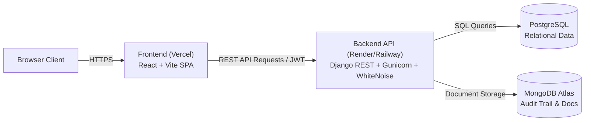

# BOST Oil Depot Approval System — Production Cloud Deployment Guide

This guide details how to deploy the full stack:
- **Backend & Relational Database**: Django REST Framework + PostgreSQL on **Render** (or Railway/Fly.io)
- **Document & Audit Database**: **MongoDB Atlas** (Free M0 Cluster)
- **Frontend**: React (Vite + TypeScript) on **Vercel**

---

## Architecture Overview



---

## Step 1: Set Up Free MongoDB Atlas (Document & Audit Store)

1. Sign up at [mongodb.com/atlas](https://www.mongodb.com/atlas).
2. Click **Create a Deployment** and select the **M0 (Free)** shared cluster.
3. **Database Access**:
   - Create a database user (e.g., `bost_admin`) and generate a secure password.
4. **Network Access**:
   - Add IP Address `0.0.0.0/0` (Allow Access from Anywhere) so your cloud backend can connect.
5. **Get Connection String**:
   - Click **Connect** → **Drivers** (Python 3.11+).
   - Copy the URI:
     ```text
     mongodb+srv://bost_admin:<password>@cluster0.xxxxxx.mongodb.net/?retryWrites=true&w=majority
     ```
   - (Replace `<password>` with your actual password and save this for Step 2).

---

## Step 2: Deploy Backend on Render

### Option A: Using the Render Blueprint (`render.yaml`) (Recommended)

1. Push your repository to GitHub / GitLab.
2. Log in to [dashboard.render.com](https://dashboard.render.com).
3. Click **New +** → **Blueprint**.
4. Select your `BOST-OIL-APPROVAL` repository.
5. Render will automatically detect `backend/render.yaml` and create:
   - A Managed **PostgreSQL Database** (`bost-postgres-db`).
   - A **Python Web Service** (`bost-manifest-api`).
6. Fill in the missing environment variables prompted in the dashboard:
   - `MONGO_URI`: Your MongoDB Atlas connection string from Step 1.
   - `CORS_ALLOWED_ORIGINS`: `https://<your-project-name>.vercel.app` (you can update this once Vercel is deployed).
7. Click **Apply**.

---

### Option B: Manual Web Service Setup on Render

1. Click **New +** → **PostgreSQL**:
   - Name: `bost-postgres`
   - Database: `bost_manifest_db`
   - User: `bost_user`
   - Plan: Free
   - Copy the **Internal Database URL**.
2. Click **New +** → **Web Service**:
   - Repository: Select your repository.
   - Root Directory: `backend`
   - Runtime: `Python 3`
   - Build Command: `./build.sh`
   - Start Command: `gunicorn bost_manifest.wsgi:application --bind 0.0.0.0:$PORT --workers 3`
3. Add **Environment Variables** in the Render settings:

| Variable | Value / Description |
|---|---|
| `PYTHON_VERSION` | `3.11.9` |
| `DEBUG` | `False` |
| `DJANGO_SETTINGS_MODULE` | `bost_manifest.settings.prod` |
| `SECRET_KEY` | Generate a 50+ character random string |
| `DATABASE_URL` | The PostgreSQL Connection String (from step 1 above) |
| `MONGO_URI` | `mongodb+srv://...` (from MongoDB Atlas) |
| `MONGO_DB_NAME` | `bost_manifest_docs` |
| `CORS_ALLOWED_ORIGINS` | `https://your-frontend.vercel.app` |
| `CSRF_TRUSTED_ORIGINS` | `https://your-frontend.vercel.app` |
| `ALLOWED_HOSTS` | `localhost,127.0.0.1,.onrender.com,.vercel.app` |

4. Click **Create Web Service**. Render will run `./build.sh` (which installs requirements, collects static files, and applies migrations) and launch Gunicorn.
5. Note your backend URL: e.g. `https://bost-manifest-api.onrender.com`.

---

## Step 3: Seed Demo Accounts & Sample Orders

Once the Render backend is live:

1. In the Render Dashboard, go to your Web Service → **Shell**.
2. Run:
   ```bash
   python manage.py seed_demo
   ```
3. (Optional) Create a superuser for Django Admin access:
   ```bash
   python manage.py createsuperuser
   ```

---

## Step 4: Deploy Frontend to Vercel

1. Log in to [vercel.com](https://vercel.com).
2. Click **Add New…** → **Project**.
3. Import your `BOST-OIL-APPROVAL` Git repository.
4. Configure the project settings:
   - **Framework Preset**: `Vite`
   - **Root Directory**: Click `Edit` and choose `frontend`.
   - **Build Command**: `npm run build`
   - **Output Directory**: `dist`
5. Under **Environment Variables**, add:

| Key | Value |
|---|---|
| `VITE_API_BASE_URL` | `https://bost-manifest-api.onrender.com` (Your Render API URL without trailing slash) |

6. Click **Deploy**.
7. Vercel will build and deploy the SPA. It will assign a domain like `https://bost-oil-approval.vercel.app`.

---

## Step 5: Final Origin Check (CORS & CSRF)

1. Copy your final Vercel URL (e.g., `https://bost-oil-approval.vercel.app`).
2. Go back to Render Dashboard → `bost-manifest-api` → **Environment**.
3. Ensure `CORS_ALLOWED_ORIGINS` and `CSRF_TRUSTED_ORIGINS` include your exact Vercel URL.
4. If changed, click **Save Changes** (Render will automatically redeploy with the updated origins).

---

## Step 6: Smoke Testing & Verification

1. Open your Vercel URL in a web browser: `https://your-app.vercel.app`.
2. Test login using any seeded account:
   - **Customer**: `customer@oiltrading.com` / `Customer@123`
   - **Manager**: `manager@bost.gov.gh` / `Manager@123`
   - **Customs**: `customs@gra.gov.gh` / `Customs@123`
   - **Loading Bay**: `depot@bost.gov.gh` / `Depot@123`
   - **System Admin**: `admin@bost.gov.gh` / `Admin@123`
3. Verify backend Swagger docs:
   - `https://bost-manifest-api.onrender.com/api/v1/docs/`
4. Verify Django admin:
   - `https://bost-manifest-api.onrender.com/admin/`
